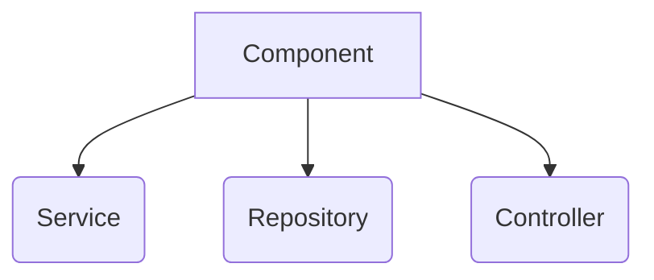

## @Configuration , @Bean
설정용 java 파일 만들때 사용 :
Spring Bean Configuration File (.xml) 대신 class(.java) 사용 가능

@Configuration
 1. class나 interface 앞에 사용 가능
 2. 컴파일될때 실행

@Bean

 1. method 앞에 사용 가능
 2. 컴파일될때 실행

```java
//Beans.java
@Configuration
public class Beans {
	@Bean
	public First first() {
		// return new First();
		First f = new First();
		f.setMsg("금요일입니다");
		return f;
	}
}

//Test.java
ApplicationContext ctx = new AnnotationConfigApplicationContext(Beans.class);
First first = ctx.getBean("first", a.First.class);
System.out.println(first.getMsg());

---------------------------------------------------
//console
금요일입니다

```
## @Autowired
클래스타입에 일치하는 객체를 찾는다. (id 상관x)
```java
//1. Namespaces -> context 추가
//2. beans.xml에 추가
<context:annotation-config/>
<bean id="second" class="a.Second2"/>

//3. A.java에 추가
@Autowired
	private Second second;
```
\--> setter, getter, 	constructor 생성 x, property 추가 x

## 
## @Qualifier

Autowired와 함께 사용.
```java
@Autowired
private Second second;
```
#### 오류1_클래스타입에 일치하는 객체가 없는 경우
NoSuchBeanDefinitionException 발생

--> 해결방안
```java
@Autowired(required = false) //null로 유지한다.
```
 #### 오류2_ 클래스타입에 일치하는 객체가 2개 이상일 경우
 ```java
 //beans.xml
 <!-- NoUniqueBeanDefinitionException -->
 <bean id="second1" class="a.Second1" />
<bean id="second2" class="a.Second2" /> 
```
--> 해결방안
```ava
//beans.xml
<bean id="second1" class="a.Second1">
		<qualifier value="s1" />
</bean>
<bean id="second2" class="a.Second2">
		<qualifier value="s2" />
</bean>

//Test.java
@Autowired
@Qualifier("s1") //second1 사용시
private Second second;
 ```

## @PostConstruct
\<bean>태그의 init-method 속성 역할.
  :객체가 생성될때 자동으로 실행되는 method 설정 가능 

```java
//beans.xml
<bean id="first" class="a.First" init-method="init">
```
 ↓ 같은 기능
```java
//Test.java
@PostConstruct
public void init() {
	System.out.println("init()호출됨");
	flag=true;
}
-----------컴파일 실행 시 --------------------------
//console
init() 호출됨
```
##
## @Component
클래스를 자동으로 스프링 빈으로 등록해준다. 
beans.xml 내 \<bean>선언 필요 X.
```java
//beans.xml에 context
<context:component-scan base-package="a"/> //a -> 스캔대상 객체가 들어있는 패키지 명

//스캔대상.java에 어노테이션 등록
@Component("id")
public class ~~

//(+)의존주입 대상이 있을때
//beans.xml의 다음과 같은 내용을
<bean>
	<qualifier value="s1" />
</bean>
//의존주입대상.java 에 다음과 같이 적용
@Component(value = "s1") 
```
<상속관계>
 @Component
@Repository @Service @Controller
[DAO]				[Service]      [Controller]


<!--stackedit_data:
eyJoaXN0b3J5IjpbMTI1NjQ5MTk3MSwxNzk3NjY5MzE0LC0xNj
MwNjE1OTE0LDEzMDE1NzM1MDgsMTI0Njg4NDg5MSw4MjAzMjk0
MiwtODgwMTQ4NzUwLC0xMjc2Mzc5NjUwLC0xNDcwMTEzMjI5LC
0xNjM3NzU3NDYxLDEyNjcwODA3ODksMTQ1NTE0NzIyOCwyMTM3
MjUzMzYwXX0=
-->